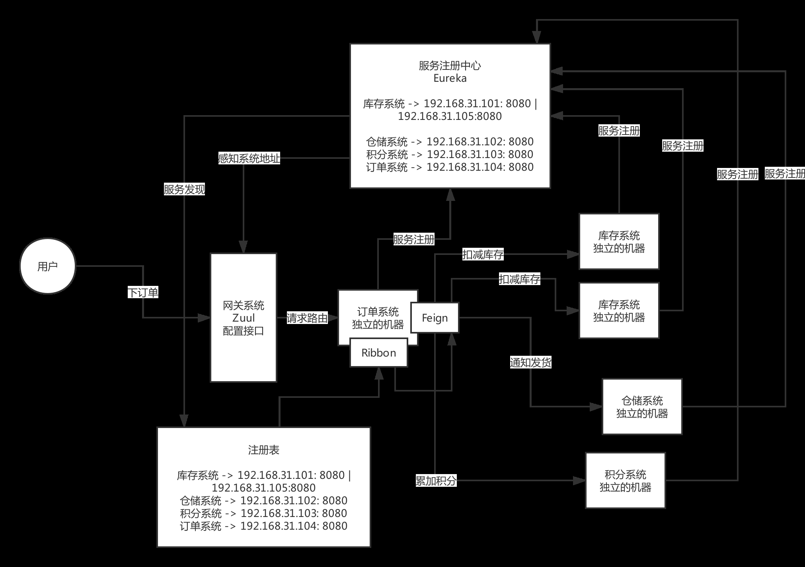
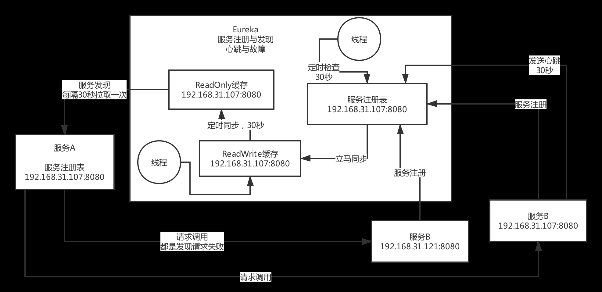
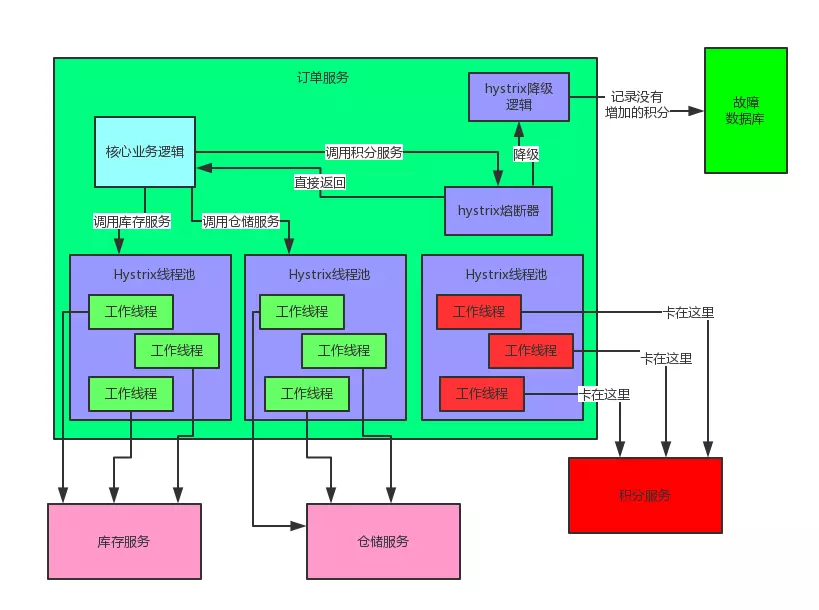

## Spring Cloud 笔记

### Spring Cloud 底层原理

#### 架构图

#### 核心组件

- consul\eureka 服务注册中心

    
    核心功能：服务注册发现，心跳与故障。
    包含两个缓存，调用方不直接取服务注册表，减少读写冲突，提高性能。
- ribbon 负载均衡
- feign 服务调用

    动态代理，底层用http

- Hystrix 服务熔断降级

    

  - 熔断
    不同服务的调用在不同的线程池中，当一个服务不可用时，调用他不等待超时，而是因为线程卡死，直接返回.防止服务雪崩。
  - 降级
    将错误记录下来，延迟执行。如通过MQ消息队列，或通过数据库日志记录。  
- zuul 网关

    网址重定向，映射链接与客户端
    统一的监控、降级、限流、认证授权(token)、安全，等等

### Spring Cloud 与 Dubbo 比较

- Dubbo 高优化RPC，性能较高
- Spring Cloud。http协议，性能略慢，但是慢不多。Spring Cloud全家桶，组件齐全，省心，不用另外找第三方组件，兼容性好。
