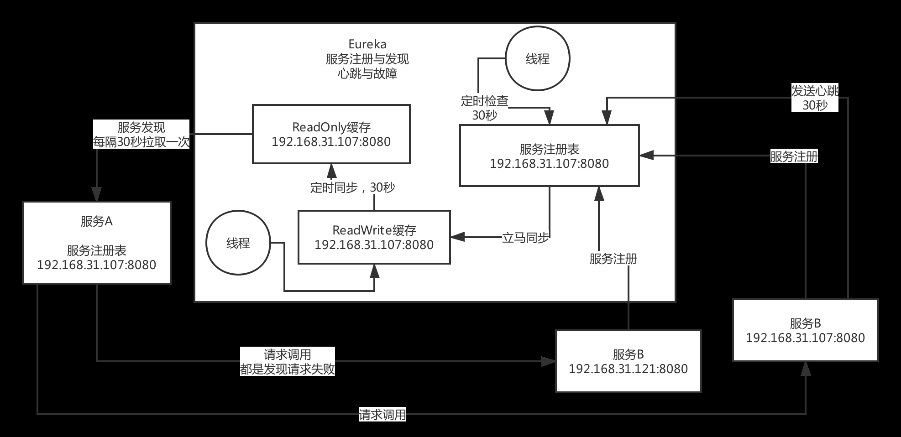

## JVM 笔记

### 问题

- JVM作用
- JVM技术选型
- JVM如何使用及原理
- JVM生产问题（高并发？）

### 1. JVM作用

- JVM的核心功能  
(1)动态路由：新开发某个服务，动态把请求路径和服务的映射关系热加载到JVM里去；服务增减机器，JVM自动热感知  
(2)灰度发布  
(3)授权认证（token）  
(4)性能监控：每个API接口的耗时、成功率、QPS  
(5)系统日志  
(6)数据缓存  
(7)限流熔断  

### 2. Eureka

- For Spring Cloud
- 模式：集群(peer-to-peer)
- CAP：高可用（AP）,不保证一致性，但保证最终一致性
- 时效性：默认配置下，时效性很差。（多个缓存，缓存定时同步）
- 很难支撑大规模的服务实例，因为每个eureka实例都要接受所有的请求，实例多了压力太大，扛不住，也很难到几千服务实例

#### 2.1 生产问题

- 如何保证高可用  
    集群部署。一台挂了，直接请求另一台。
- 生产环境配置

    server端application.yml配置：
    关掉自我保护机制：eureka.server.enableSelfPreservation = false  
    注册表缓存同步时间3秒：eureka.server.responseCacheUpdateIntervalMs = 3000  
    心跳检测间隔6秒：eureka.server.evictionIntervalTimerInMs = 6000  
    超过多少秒停止心跳删除注册9秒：eureka.instance.leaseExpirationDurationInSeconds = 9

    client端application.yml配置：  
    客户端拉取注册表时间3秒：eureka.client.registryFetchIntervalSeconds = 3000  
    客户端心跳间隔3秒：eureka.client.leaseRenewalIntervalInSeconds = 3

### 3. Zookeeper

- For Dubbo
- 模式：主从(leader-follower)，只有leader可写，leader和follower都可读。
- CAP：高一致性（AP）
- 时效性：可以达到秒级。
- 不适合大规模的服务实例。因为服务上下线的时候，需要瞬间推送数据通知到所有的其他服务实例，所以一旦服务规模太大，到了几千个服务实例的时候，会导致网络带宽被大量占用

#### 3.1 生产问题

- 如何保证高可用  
集群主从部署。可用性较低一些，leader服务挂了，重新选举leader的过程会导致服务不可用。

