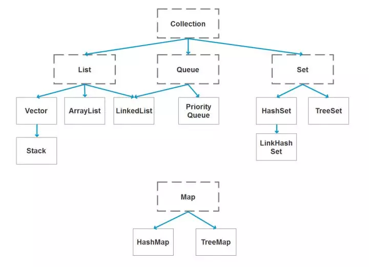
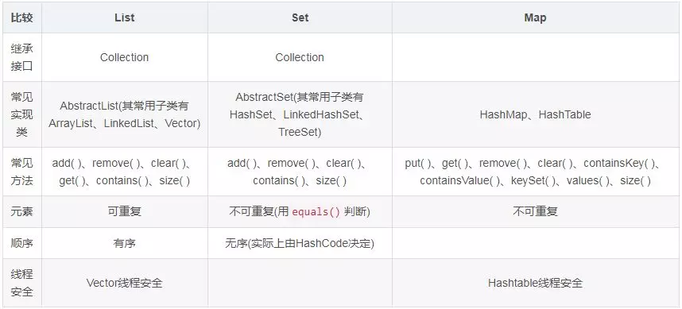

<!-- TOC -->

- [一、容器](#%e4%b8%80%e5%ae%b9%e5%99%a8)

<!-- /TOC -->

## 一、容器

1. java 容器都有哪些  

顶级接口collection，子接口List、Queue、Set。
顶级接口Map：HashMap、Hashtable、LinkedHashMap和TreeMap
2. Collection 和 Collections 有什么区别？  
Collections是集合类的一个工具类/帮助类，其中提供了一系列静态方法，用于对集合中元素进行排序、搜索以及线程安全等各种操作。
Collection是集合类的一个顶级接口。提供了各种对集合对象操作的基本方法。它的意义是为各种具体的集合提供统一的操作方式。
3. List、Set、Map 之间的区别是什么？  
   
4. HashMap 和 Hashtable 、ConcurrentHashMap有什么区别？  
   Hashtable线程安全，效率低，基本被弃用。（而且不遵循驼峰命名）。key和value都不允许null。  
   HashMap线程不安全，效率高，允许一个key为null，允许多个value为null。  
   拓展：在HashMap中不能由get()方法来判断HashMap中是否存在某个键， 而应该用containsKey()方法来判断。当get()方法返回null值时，可能是 HashMap中没有该键，也可能使该键所对应的值为null。  
   需要线程安全时可用ConcurrentHashMap。ConcurrentHashMap虽然也是线程安全的，但是它的效率比Hashtable要高好多倍。因为ConcurrentHashMap使用了分段锁，并不对整个数据进行锁定。
5. 如何决定使用 HashMap 还是 TreeMap？  
   HashMap基于散列桶（数组和链表）实现；TreeMap基于红黑树实现。 
   HashMap不支持排序；TreeMap默认是按照Key值升序排序的，可指定排序的比较器，主要用于存入元素时对元素进行自动排序。  
   HashMap大多数情况下有更好的性能，尤其是读数据。在没有排序要求的情况下，使用HashMap。
   都是非线程安全。
6. HashMap 的实现原理？  
   哈希数组+链表/红黑树。key值通过hash算法算得数组下标，已经被占用就转链表。
   jdk1.8后HashMap引入了红黑树，链表长度>8转为红黑树，时间复杂度从原来的O(n)到O(logn).  
   拓展：负载因子。默认为0.75，对于size固定的，可设为1.
7. HashSet 的实现原理？  
   值不重复的集合。HashSet底层由HashMap实现,  
   HashSet的值存放于HashMap的key上,  
   HashMap的value统一为PRESENT  
   拓展：add实现是如何判断值不重复的  
   public boolean add(E e)  
   {  
      return map.put(e, PRESENT) == null;  
   }
8. ArrayList 和 LinkedList 的区别是什么?  
   最明显的区别是 ArrrayList底层的数据结构是**数组**，支持随机访问，而LinkedList 的底层数据结构是**双向循环链表**，不支持随机访问。使用下标访问一个元素，ArrayList 的时间复杂度是 O(1)，而 LinkedList 是 O(n)。  
   对于随机访问get和set，ArrayList觉得优于LinkedList，因为LinkedList要移动指针。 
   对于新增和删除操作add和remove，LinedList比较占优势，因为ArrayList要移动数据。（LinedList容量大的话，修改链表中间的元素，遍历也是很大的开销） 
9. 如何实现数组和 List 之间的转换？  
   List转换成为数组：调用ArrayList的toArray方法。  
   数组转换成为List：调用Arrays的asList方法。
10. ArrayList 和 Vector 的区别是什么？  
    都是数组，Vector线程间同步（**线程安全**），即某一时刻只有一个线程能够写Vector，避免多线程同时写而引起的不一致性，但实现同步需要很高的花费，因此，访问它比访问ArrayList慢。
11. Array 和 ArrayList 有何区别？  
    ArrayList是容器，只能容纳包装类型。   
    Array定义时必须指定大小，而ArrayList长度可变 
12. 在 Queue 中 poll()和 remove()有什么区别？  
    Queue线性表，**先进先出**。  
    poll() 和 remove() 都是从队列中取出一个元素，但是 poll() 在获取元素失败的时候会返回空，但是 remove() 失败的时候会抛出异常。
13.  哪些集合类是线程安全的？  
    vector：就比arraylist多了个同步化机制（线程安全），因为效率较低，现在已经不太建议使用。在web应用中，特别是前台页面，往往效率（页面响应速度）是优先考虑的。  
    statck：堆栈类，先进后出。（继承了Vector类，估计也少用）  
    hashtable：就比hashmap多了个线程安全。（现在少用）  
    enumeration：枚举，相当于迭代器。（现在少用）
14.  迭代器 Iterator 是什么？  
    一个用于遍历序列（如数组）的对象，是一种设计模式。  
    foreach和Iterator：  
    foreach循环时原集合不能变化不能用array.remove()。而迭代器可以Iterator。
    foreach的get()通过下标快速获取指定元素，适合遍历ArrayList这样的顺序集合。Iterator的next适合遍历链式结构，如链表。
    迭代器不需要考虑集合的内部实现。即一个List的Iterator，数据结构改成Set了，遍历部分的代码不需要改变。而如果用的是传统for循环，那所有遍历此集合的算法都得做相应调整,因为List有序,Set无序,结构不同,他们的访问算法也不一样.
15. Iterator 怎么使用？有什么特点？
    Iterator<String> it = list.iterator();//容器返回一个Iterator
    while(it.hasNext()){                  //检查序列中是否还有元素
        String x = it.next();             //获得序列中的下一个元素
        if(x.equals("del")){
            it.remove();                  //将迭代器新返回的元素删除
        }
    }
16. Iterator 和 ListIterator 有什么区别？
    ListIterator为List设计，可双向遍历，也可以从List中插入和删除元素。
17.  两个链表相交，求交点
  